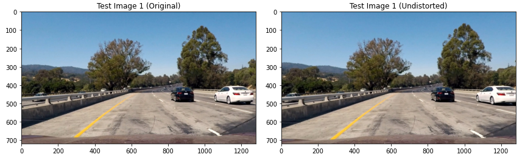
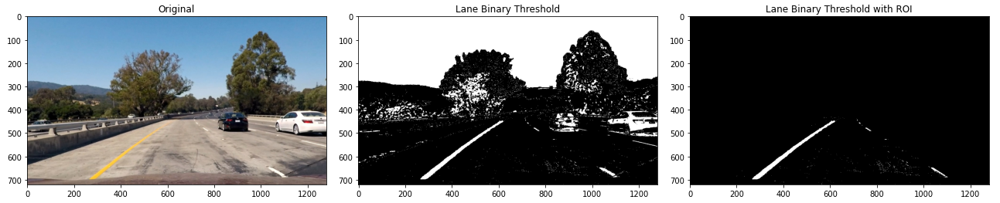
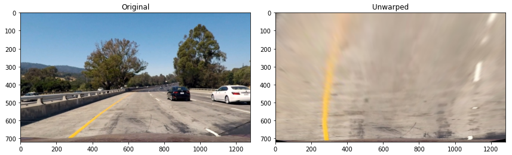
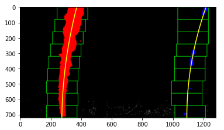
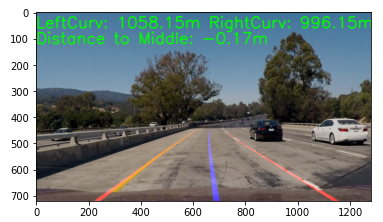

## Advanced Lane Finding

This project is to find lanes on the road for car while driving.

## Camera Calibration

### Calculate camera matrix and distortion coefficients

To compute matrix, we use chessboard image files under the folder `camera_cal`.

Note we are using `nx=9` and `ny=6` for chessboard images.

First we need to find chessboard corners using `cv2.findChessboardCorners()`, then calculate the camera matrix `mtx` and distortion coefficients `dist` with `cv2.calibrateCamera()`.

After `mtx` and `dist` are calculated, we can undistort the image with `cv2.undistort()`.

An example of undistort image:

For the code, please refer to **AdvancedLaneLines.ipynb** notebook: Camera Calibration.

## Pipeline (test images)

### Generate Distorion-Corrected Image

An example of a distortion-corrected image:

### 2. Generate Threshold Binary Image

Threshold binary image is a mixed decision of gradient binary (at X axis), direction binary, magnitude binary and hls binary (with S colorspace) .

### Perspective Transform

For perspective transform, we need to use the perspective transform matrix `M` which is calculated by `cv2.getPerspectiveTransform()` with 4 source coordinates and 4 target coordinates of straight line images.

The we can apply it to the curved line images with `cv2.warpPerspective()`, such as below:

### Lane-Line with Polynomial

Generate with `np.polyfit()` with left side image and right side image.

We seperate this to several windows at Y axis with margin (margin is to avoid big error on X-axis).

Below is an image with polynomial fit:

### Radius Curvature, Distance to middle, and Lane Lines

For radius curative, we use the formula of (Radius Curvature)[https://en.wikipedia.org/wiki/Radius_of_curvature].

To calculate the distance and radius curvature of real world, we need to specify the relationship between pixels and real-world distance.

Here we use `xm_per_pix` and `ym_per_pix` for the real distance of one pixel at X-axis and Y-axis respectivelly.

Distance to the middle lane, is the distance the middle of two lane lines and the middle of the image.

Here I use `cv2.putText()` to generate the output image:

We also example image of your result plotted back down onto the road.

The pipeline is implemented with function `generate_detected_image()`.

## Pipeline (video)

Video output after we use `generate_detected_image()` for all frames:

`./challenge_video-output.mp4`

## Problems

- The hyperparameter of binary threshold is difficult to tune.
- The other lanes might also be recognized as lane line.
- Some times there is only 1 lane detected on left side for video; and there's no lane detected at right side.

Maybe we can use CNN (such as YOLO) with ROI to generate more robust lane line images.